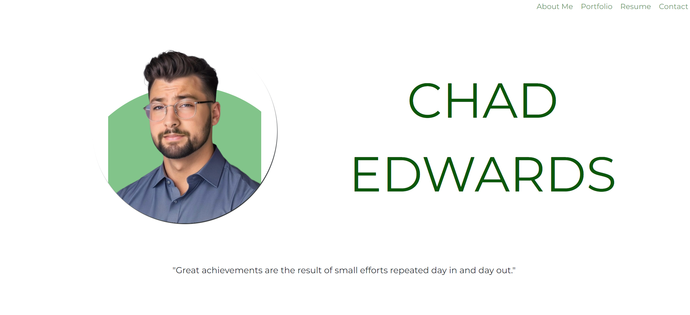

# React Portfolio
  - Application Screenshot : 
  
  ## Description
  Portfolio Website built using React. Conditional Rendering for each page displayed as a SPA with a navbar. Styling used mixed of Bootstrap and Original CSS. 
  
  ## Table of Contents
  - [Installation](#installation)
  - [Contributing](#contributing)
  - [Questions](#questions)
  
  ## Installation
  Any user can clone the repository provided here "https://github.com/chadedwardsofficial/React-Portfolio"
  
  ## Deployed Website
  Website used Netlify : 
  "https://main--aesthetic-gaufre-624c86.netlify.app/"
  
  ## Contributing
 Bootstrap and Vite. 

  ## Questions
  My email [chadedwardsofficial@gmail.com](mailto:chadedwardsofficial@gmail.com). You can also find me on [GitHub](https://github.com/chadedwardsofficial).
  